# Edu-Learn Platform - System Architecture

## Table of Contents
1. [High-Level Overview](#high-level-overview)
2. [System Architecture Diagram](#system-architecture-diagram)
3. [Technology Stack](#technology-stack)
4. [Frontend Architecture](#frontend-architecture)
5. [Backend Architecture](#backend-architecture)
6. [Database Schema](#database-schema)
7. [API Structure](#api-structure)
8. [Real-Time Communication](#real-time-communication)
9. [Authentication & Authorization](#authentication--authorization)
10. [Data Flow Diagrams](#data-flow-diagrams)

---

## High-Level Overview

Edu-Learn is a comprehensive online learning platform that connects students with courses and mentors. The platform supports course management, interactive quizzes, real-time chat, mentor sessions, and progress tracking.

### Key Features
- **Multi-Role System**: Students, Mentors, and Admins
- **Course Management**: Create, edit, and browse courses with lessons and quizzes
- **Interactive Learning**: Quiz system with topic-based recommendations
- **Mentor System**: Book, confirm, and reschedule mentor sessions
- **Real-Time Chat**: WebSocket-based messaging between users
- **Admin Dashboard**: User management, course management, and analytics

---

## System Architecture Diagram

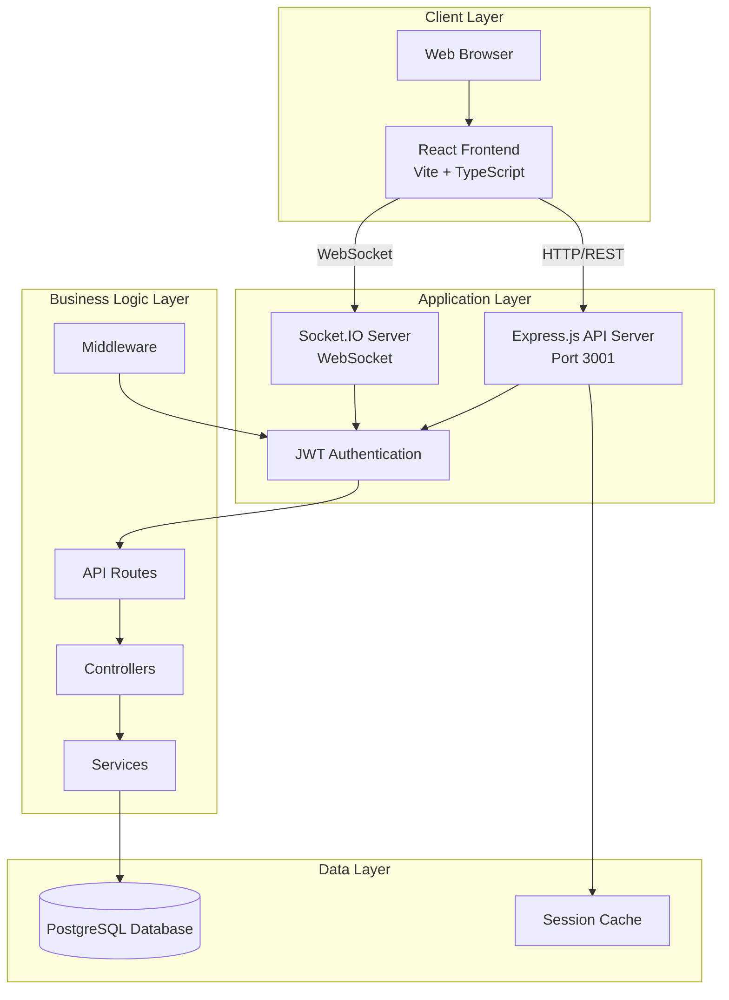

---

## Technology Stack

### Frontend
| Technology | Purpose | Version |
|------------|---------|---------|
| **React** | UI Framework | 18.x |
| **TypeScript** | Type Safety | 5.x |
| **Vite** | Build Tool & Dev Server | Latest |
| **TailwindCSS** | Styling Framework | 3.x |
| **Axios** | HTTP Client | Latest |
| **Lucide React** | Icon Library | Latest |
| **Socket.IO Client** | Real-time Communication | Latest |

### Backend
| Technology | Purpose | Version |
|------------|---------|---------|
| **Node.js** | Runtime Environment | 18+ |
| **Express.js** | Web Framework | 4.x |
| **TypeScript** | Type Safety | 5.x |
| **PostgreSQL** | Primary Database | 13+ |
| **Socket.IO** | WebSocket Server | Latest |
| **JWT** | Authentication | Latest |
| **bcrypt** | Password Hashing | Latest |
| **pg** | PostgreSQL Client | Latest |

### DevOps & Tools
- **ts-node-dev**: Development server with hot reload
- **dotenv**: Environment variable management
- **CORS**: Cross-origin resource sharing
- **ESLint**: Code linting

---

## Frontend Architecture

### Component Structure

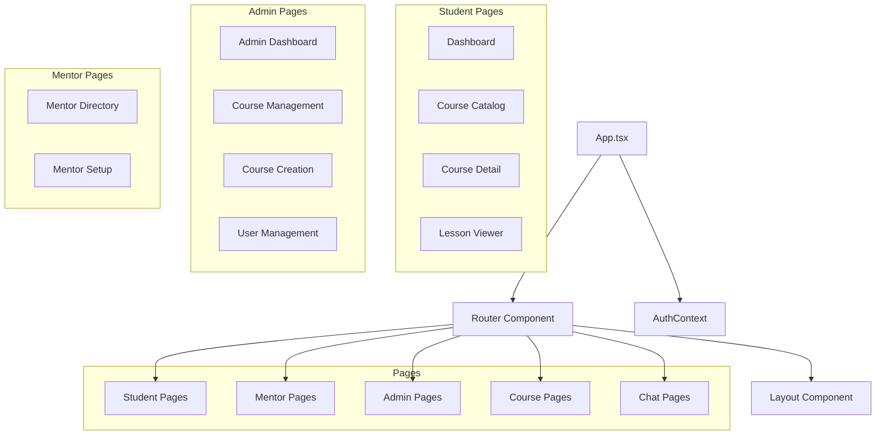

### Key Frontend Components

#### Pages Directory Structure
```
src/pages/
├── admin/
│   ├── AdminDashboard.tsx       # Admin overview & stats
│   ├── AdminCourseManagement.tsx # Course CRUD operations
│   ├── CourseCreation.tsx       # Create/Edit courses & lessons
│   └── UserManagement.tsx       # User role management
├── student/
│   └── StudentDashboard.tsx     # Student progress & enrolled courses
├── courses/
│   ├── CourseCatalog.tsx        # Browse all courses
│   └── CourseDetail.tsx         # Course overview & enrollment
├── lessons/
│   └── LessonViewer.tsx         # View lessons & take quizzes
├── mentors/
│   └── MentorDirectory.tsx      # Browse & book mentors
├── mentor/
│   └── MentorSetup.tsx          # Mentor profile setup
├── chat/
│   └── ChatPage.tsx             # Real-time messaging
├── auth/
│   ├── LoginPage.tsx
│   └── RegisterPage.tsx
└── profile/
    └── ProfilePage.tsx
```

### State Management
- **AuthContext**: Global authentication state (user, role, token)
- **Local State**: Component-level state with React hooks
- **API State**: Managed via axios with cache-busting

---

## Backend Architecture

### Layered Architecture

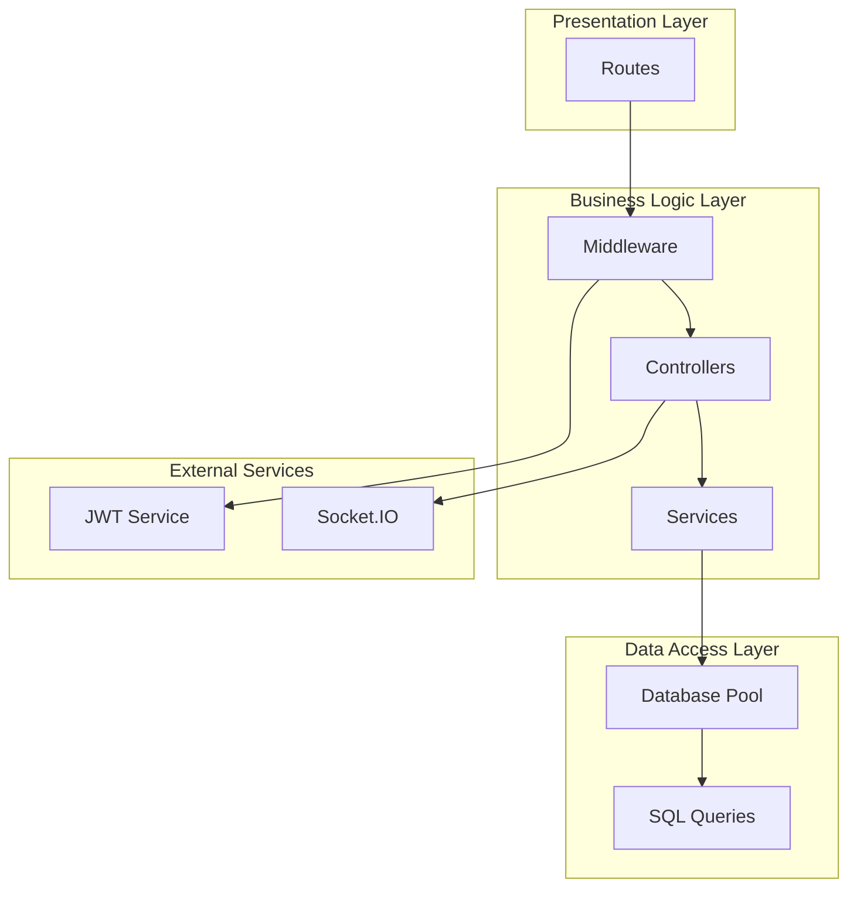

### API Routes Structure

```
backend/src/routes/
├── auth.routes.ts           # /api/auth/*
│   ├── POST /register
│   └── POST /login
├── admin.routes.ts          # /api/admin/*
│   ├── GET /stats
│   ├── GET /courses
│   ├── POST /courses
│   ├── PUT /courses/:id
│   ├── PUT /courses/:id/lessons
│   ├── POST /courses/:id/seed-lessons
│   ├── GET /lessons/all
│   ├── GET /users
│   ├── PATCH /users/:id/role
│   └── DELETE /users/:id
├── courses.routes.ts        # /api/courses/*
│   ├── GET /catalog
│   ├── GET /:id
│   ├── POST /:id/enroll
│   └── GET /lessons
├── quiz.routes.ts           # /api/quizzes/*
│   ├── GET /:id
│   ├── POST /:id/attempt
│   └── GET /attempts/:attemptId
├── mentor.routes.ts         # /api/mentors/*
│   ├── GET /
│   └── GET /:id
├── mentorSession.routes.ts  # /api/mentor-sessions/*
│   ├── POST /book
│   ├── PATCH /:id/confirm
│   └── PATCH /:id/reschedule
├── chat.routes.ts           # /api/chat/*
│   ├── GET /conversations
│   ├── GET /conversations/:id/messages
│   └── POST /conversations/:id/messages
├── student.routes.ts        # /api/student/*
│   └── GET /dashboard
└── profile.routes.ts        # /api/profile/*
    ├── GET /
    └── PUT /
```

---

## Database Schema

### Entity Relationship Diagram

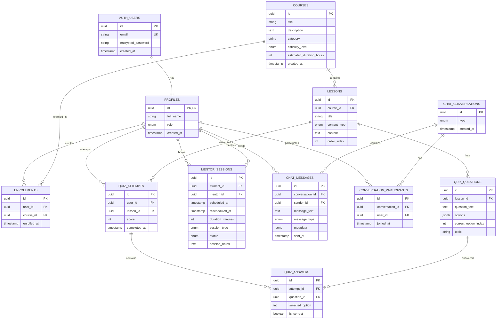

### Key Database Tables

#### Authentication Schema (`auth` namespace)
- **users**: Email, encrypted password, user ID

#### Public Schema
- **profiles**: User profiles with role (student, mentor, admin)
- **courses**: Course metadata and details
- **lessons**: Course content (text, video, quiz)
- **quiz_questions**: Questions with options and correct answers
- **quiz_attempts**: User quiz submissions and scores
- **quiz_answers**: Individual question answers
- **enrollments**: Student-course relationships
- **mentor_sessions**: Scheduled sessions (status: scheduled, completed, cancelled)
- **chat_conversations**: Direct and group conversations
- **chat_messages**: Messages with type (text, session_booking)
- **conversation_participants**: User-conversation relationships

---

## API Structure

### RESTful API Endpoints

#### Authentication
```
POST /api/auth/register
POST /api/auth/login
```

#### Courses
```
GET  /api/courses/catalog          # Browse all courses
GET  /api/courses/:id              # Get course details
POST /api/courses/:id/enroll       # Enroll in course
GET  /api/courses/lessons?topic=X  # Get lessons by topic
```

#### Quizzes
```
GET  /api/quizzes/:id              # Get quiz questions
POST /api/quizzes/:id/attempt      # Submit quiz attempt
GET  /api/quizzes/attempts/:id     # Get attempt results
```

#### Admin
```
GET    /api/admin/stats            # Platform statistics
GET    /api/admin/courses          # All courses
POST   /api/admin/courses          # Create course
PUT    /api/admin/courses/:id      # Update course
PUT    /api/admin/courses/:id/lessons  # Update lessons
GET    /api/admin/lessons/all      # All lessons
GET    /api/admin/users            # All users
PATCH  /api/admin/users/:id/role   # Update user role
DELETE /api/admin/users/:id        # Delete user
```

#### Mentors
```
GET   /api/mentors                 # Browse mentors
GET   /api/mentors/:id             # Mentor details
POST  /api/mentor-sessions/book    # Book session
PATCH /api/mentor-sessions/:id/confirm    # Confirm session
PATCH /api/mentor-sessions/:id/reschedule # Reschedule session
```

#### Chat
```
GET  /api/chat/conversations
GET  /api/chat/conversations/:id/messages
POST /api/chat/conversations/:id/messages
```

---

## Real-Time Communication

### WebSocket Architecture

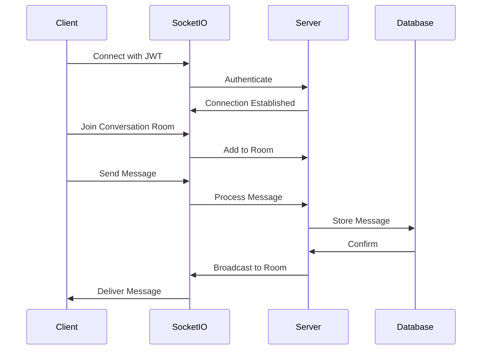

### Socket.IO Events
- **Connection**: User authentication and room joining
- **new_message**: Real-time message delivery
- **message_updated**: Update existing messages (e.g., session confirmations)
- **typing**: Typing indicators
- **disconnect**: Clean up user sessions

---

## Authentication & Authorization

### JWT-Based Authentication Flow

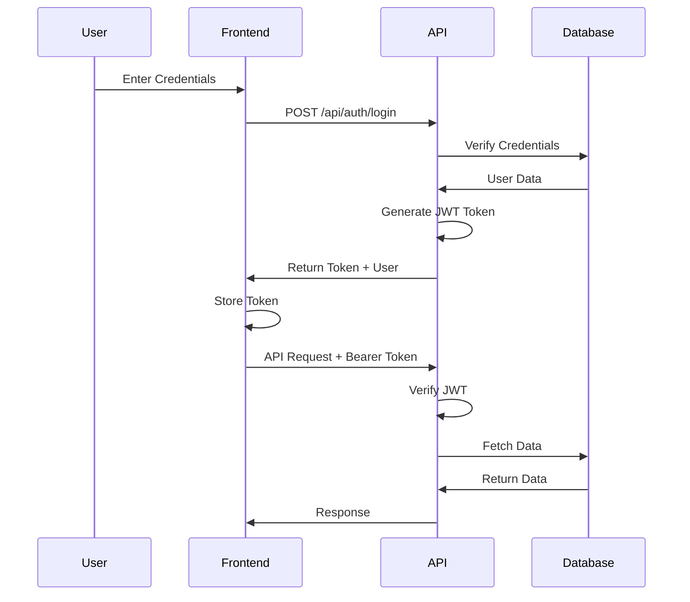

### Role-Based Access Control
- **Student**: Access courses, take quizzes, book mentors, chat
- **Mentor**: Manage sessions, chat with students, view profile
- **Admin**: Full access to user management, course management, analytics

### Middleware Stack
1. **CORS**: Cross-origin request handling
2. **JSON Parser**: Request body parsing
3. **requireAuth**: JWT token validation
4. **Role Check**: Route-specific role validation

---

## Data Flow Diagrams

### User Registration & Login Flow

#### Registration Flow
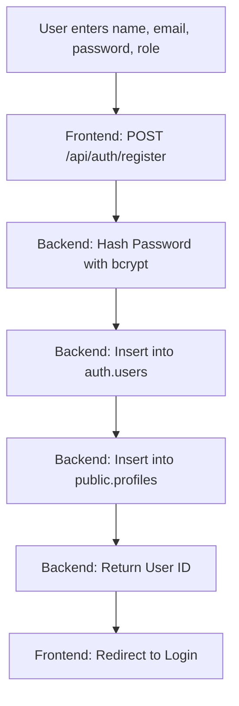

#### Login Flow
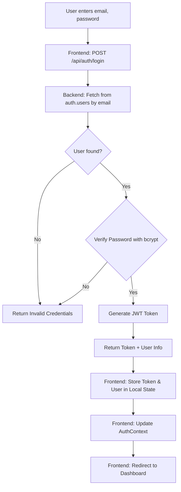

### Course Enrollment Flow

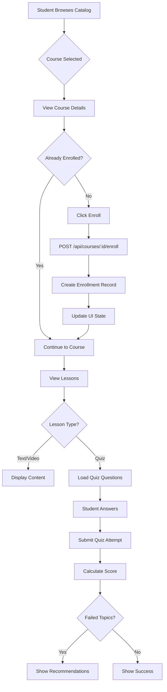

### Mentor Session Booking Flow

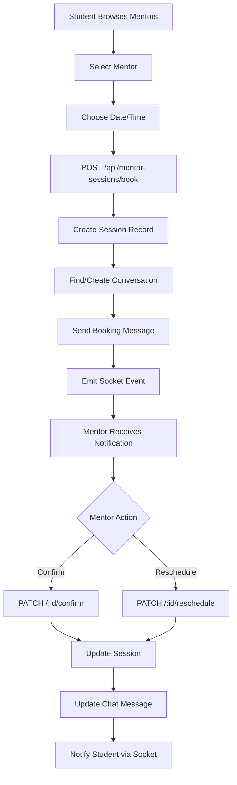

### Admin User Management Flow

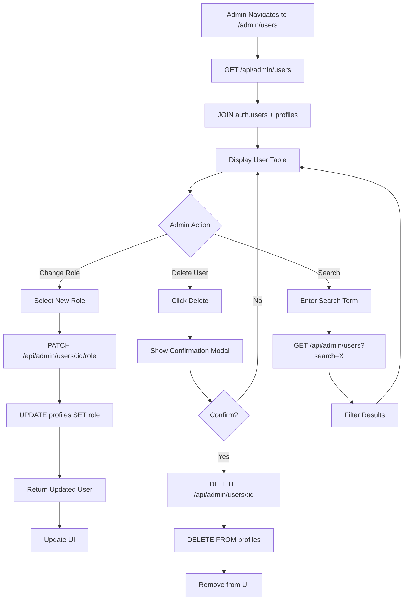

---

## Deployment Architecture

### Development Environment
```
Frontend: http://localhost:5173 (Vite Dev Server)
Backend:  http://localhost:3001 (Express + ts-node-dev)
Database: PostgreSQL (Local or Remote)
```

### Production Considerations
1. **Frontend**: Build with `npm run build`, serve static files
2. **Backend**: Compile TypeScript, run with Node.js
3. **Database**: PostgreSQL with connection pooling
4. **Environment Variables**: Secure storage of JWT_SECRET, DB credentials
5. **CORS**: Configure allowed origins
6. **WebSocket**: Ensure WebSocket support in hosting environment

---

## Security Measures

### Implemented Security Features
1. **Password Hashing**: bcrypt with salt rounds
2. **JWT Tokens**: 7-day expiration
3. **SQL Injection Prevention**: Parameterized queries
4. **CORS**: Configured cross-origin policies
5. **Role-Based Access**: Middleware-enforced permissions
6. **Input Validation**: Server-side validation for all inputs

### Recommended Enhancements
- Rate limiting on API endpoints
- HTTPS enforcement
- Refresh token rotation
- Session management
- Input sanitization
- CSRF protection
- Content Security Policy headers

---

## Performance Optimizations

### Current Optimizations
1. **Database Connection Pooling**: Reuse connections
2. **Cache-Busting**: Timestamp-based fresh data loading
3. **Lazy Loading**: Component-level code splitting
4. **WebSocket**: Efficient real-time updates
5. **Indexed Queries**: Database indexes on foreign keys

### Future Optimizations
- Redis caching layer
- CDN for static assets
- Database query optimization
- Image optimization
- Pagination for large datasets
- Server-side rendering (SSR)

---

## Monitoring & Logging

### Current Logging
- Console logging for errors and key events
- Database query logging (development)
- Socket.IO connection logs

### Recommended Additions
- Structured logging (Winston, Pino)
- Error tracking (Sentry)
- Performance monitoring (New Relic, DataDog)
- Database query analytics
- User activity tracking

---

## Conclusion

The Edu-Learn platform is built with a modern, scalable architecture that separates concerns between frontend, backend, and database layers. The use of TypeScript throughout ensures type safety, while the modular structure allows for easy maintenance and feature additions.

### Key Architectural Strengths
- **Separation of Concerns**: Clear boundaries between layers
- **Type Safety**: TypeScript on both frontend and backend
- **Real-Time Capabilities**: WebSocket integration for live updates
- **Scalable Database Design**: Normalized schema with proper relationships
- **RESTful API**: Standard HTTP methods and status codes
- **Role-Based Access**: Secure, permission-based routing

### Future Architecture Considerations
- Microservices migration for high-traffic modules
- GraphQL API for flexible data fetching
- Caching layer for frequently accessed data
- Message queue for asynchronous processing
- Containerization with Docker
- Kubernetes orchestration for scaling
